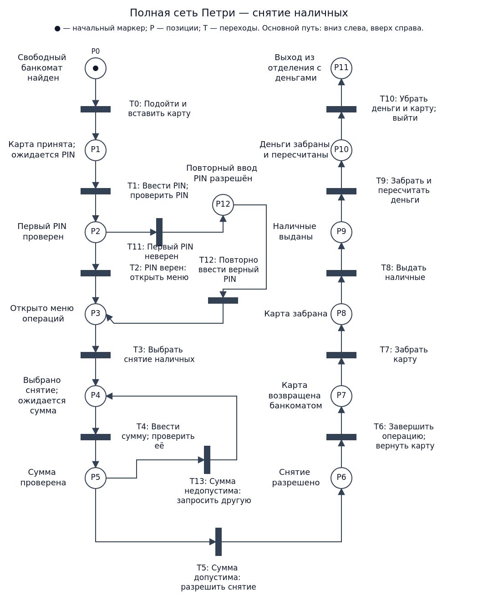
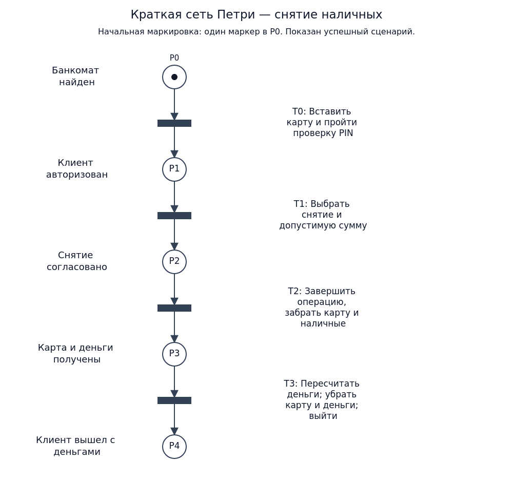

# Отчёт по заданию 00

Российский университет транспорта

Дисциплина: Web-программирование

Тема: Сети Петри простых ситуаций. Вариант 7

Выполнил: Тумасян Тигран Аршакович, группа ТКИ-541

Проверил: Сафронов Антон Игоревич

Москва, 2026

## 1. Цель работы

Описать бытовой процесс снятия наличных через банкомат и представить его полной и краткой сетями Петри.

## 2. Формулировка задачи

Вариант 7: «Снятие наличных денежных средств через банкомат в отделении банка». Начало процесса — обнаружение свободного банкомата, завершение — уход из отделения банка с полученными денежными средствами. Требуется подробное текстовое описание, полная и краткая сети Петри, описание краткой сети и вывод.

## 3. Детализированное текстовое описание ситуации

Обнаружив свободный банкомат в отделении банка, я подхожу к нему и вставляю карту. Банкомат принимает карту и предлагает ввести PIN. Я прикрываю клавиатуру рукой, ввожу PIN и подтверждаю ввод. Банкомат проверяет введённый код.

Если PIN верен, открывается меню операций. Если я ошибся при первом вводе, банкомат сообщает об ошибке и разрешает повторный ввод. В рассматриваемом сценарии при повторной попытке я ввожу правильный PIN, после чего открывается меню. Повторная ошибка и удержание карты в эту модель не включены.

В меню я выбираю снятие наличных и указываю сумму. Банкомат проверяет возможность выдачи: доступный остаток средств, ограничения на снятие и наличие подходящих купюр. Если сумма недопустима, банкомат предлагает изменить её, и я ввожу другую сумму. Предполагается, что допустимую сумму удаётся подобрать.

После разрешения снятия я завершаю операцию. Я забираю карту; затем банкомат выдаёт наличные. Я забираю и пересчитываю деньги, убираю карту и наличные. После этого ухожу из отделения с полученными деньгами.

Допущения: банкомат исправен; карта пригодна для операции; при ошибке первого PIN следующая попытка успешна; допустимая сумма существует; карта возвращается раньше наличных. Отмена операции, удержание карты, технические сбои и завершение без денег находятся за границами модели.

## 4. Сеть Петри — схема ситуации

Круги обозначают позиции (состояния), прямоугольники — переходы (действия или события). Дуги соединяют только позицию с переходом или переход с позицией. Чёрная точка обозначает маркер. В начальной маркировке единственный маркер находится в P0; все остальные позиции пусты. При срабатывании перехода маркер перемещается из его входной позиции в выходную.

Ветвления полной сети абстрактно представляют возможные результаты проверок. Сеть не вычисляет PIN и баланс: выбор исхода отражает результат внешней проверки. Параллельные действия в этом последовательном сценарии не выделяются.

### 4.1. Полная сеть

Основной путь: P0 → T0 → P1 → T1 → P2 → T2 → P3 → T3 → P4 → T4 → P5 → T5 → P6 → T6 → P7 → T7 → P8 → T8 → P9 → T9 → P10 → T10 → P11.

После разрешения снятия (P6) переход T6 объединяет завершение операции и возврат карты банкоматом. В P7 карта доступна для получения; T7 — забрать карту, P8 — карта забрана. Затем T8 — выдача наличных, P9 — наличные выданы; T9 — забрать и пересчитать деньги, P10 — деньги забраны и пересчитаны. Переход T10 объединяет уборку карты и денег и выход из отделения.

Ветка ошибки PIN: P2 → T11 → P12 → T12 → P3. Первая ошибка приводит к отдельному состоянию повторного ввода; следующая попытка по допущению успешна. Это исключает бесконечный цикл неправильного PIN.

Ветка недопустимой суммы: P5 → T13 → P4. После изменения суммы проверка выполняется снова. Модель допускает повторение этой ветви; успешное завершение предполагает последующий выбор допустимой суммы.

Конечная маркировка успешного сценария: один маркер в P11. Из этой позиции исходящих дуг нет.

### 4.2. Краткая сеть

### 4.3. Описание краткой сети Петри

В краткой сети обозначения P и T введены заново и относятся только к этой схеме. Подробные действия и повторные попытки объединены в укрупнённые переходы успешного сценария.

P0: обнаружен свободный банкомат. T0: подойти, вставить карту и успешно пройти проверку PIN. P1: клиент авторизован.

T1: выбрать снятие и указать допустимую сумму. P2: снятие согласовано.

T2: завершить операцию, забрать карту, затем наличные. P3: карта и деньги получены.

T3: пересчитать и убрать деньги, убрать карту и покинуть отделение. P4: клиент вышел с деньгами. Единственный маркер последовательно проходит от P0 к P4.

## 5. Вывод

Процесс снятия наличных описан словами и двумя сетями Петри. Полная сеть показывает проверку PIN, повторный ввод, проверку суммы и получение карты и денег. Краткая сеть объединяет действия в основные этапы. Обе схемы соответствуют выбранным границам процесса: от обнаружения свободного банкомата до ухода с наличными.
